🧩 Vue2 → Vue3 Composition API Migration Summary
📁 프로젝트 개요

이 프로젝트는 Vue 2 기반의 Options API 예제들을
Vue 3 기반 Composition API 문법으로 전환한 실습 모음입니다.
모든 컴포넌트는 <script setup> 구조로 통일되었으며,
명확한 포맷 규칙에 따라 리팩터링되었습니다.

🧱 전환 기준 포맷

모든 .vue 파일은 아래 포맷을 엄격히 유지합니다.


```
<template>
  <!-- 템플릿 -->
</template>

<script lang="ts">
export default {
  name: 'ComponentName'
}
</script>

<script setup lang="ts">
<!-- Composition API 로직 -->
</script>

<style scoped>
<!-- 스타일 -->
</style>
```


```
구분                | 변경 전 (Vue 2)                            | 변경 후 (Vue 3 Composition API)
────────────────────┼────────────────────────────────────────────┼────────────────────────────────────────────
컴포넌트 정의        | export default { ... }                     | <script setup> + export default { name: ... }
데이터 정의          | data() { return { ... }}                   | ref() 또는 reactive()
계산 속성            | computed: { ... }                         | computed(() => …)
메서드               | methods: { ... }                          | setup 내부 함수 정의
감시자               | watch: { ... }                            | watch(ref, callback)
라이프사이클         | mounted(), updated() 등                   | onMounted(), onUpdated() 등
props 정의           | props: { title: { default: '...' }}        | withDefaults(defineProps(), { title: '...' })
이벤트 전달          | $emit('event')                            | emit('event') (defineEmits 사용 가능)
provide/inject       | provide(), inject: []                      | provide(), inject()
DOM 참조             | ref="input" → this.$refs.input             | const input = ref(null) → input.value
```


✅ 빌드 및 실행
# 의존성 설치
npm install

# 개발 서버 실행
npm run serve

# 프로덕션 빌드
npm run build

🏁 요약

🎯 모든 컴포넌트는 Vue 3 Composition API 기반으로 완전 변환 완료
🧱 포맷·타입·라이프사이클 일관성 확보
🚀 빌드 및 실행 시 정상 동작 확인


## 🖼️ 실행 화면 (Screenshots)

아래는 모든 Vue 3 Composition API 컴포넌트의 실제 실행 결과 화면입니다.  
이미지는 `/screenshots` 폴더에 위치합니다.

---

| 컴포넌트 | 실행 화면 |
|-----------|------------|
| **E01Instance** | 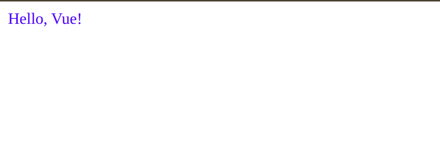 |
| **E02Reactive** | 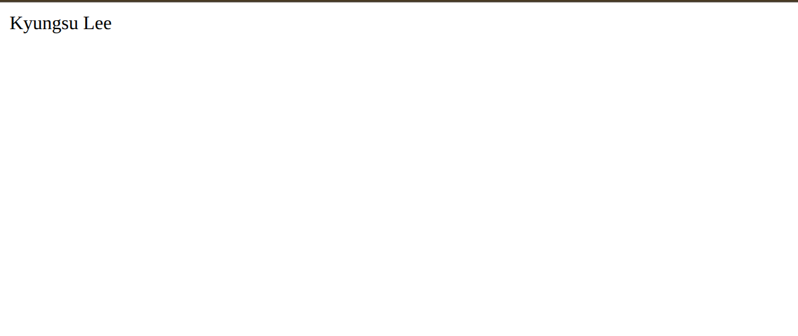 |
| **E03Binding** |  |
| **E04Directives** | 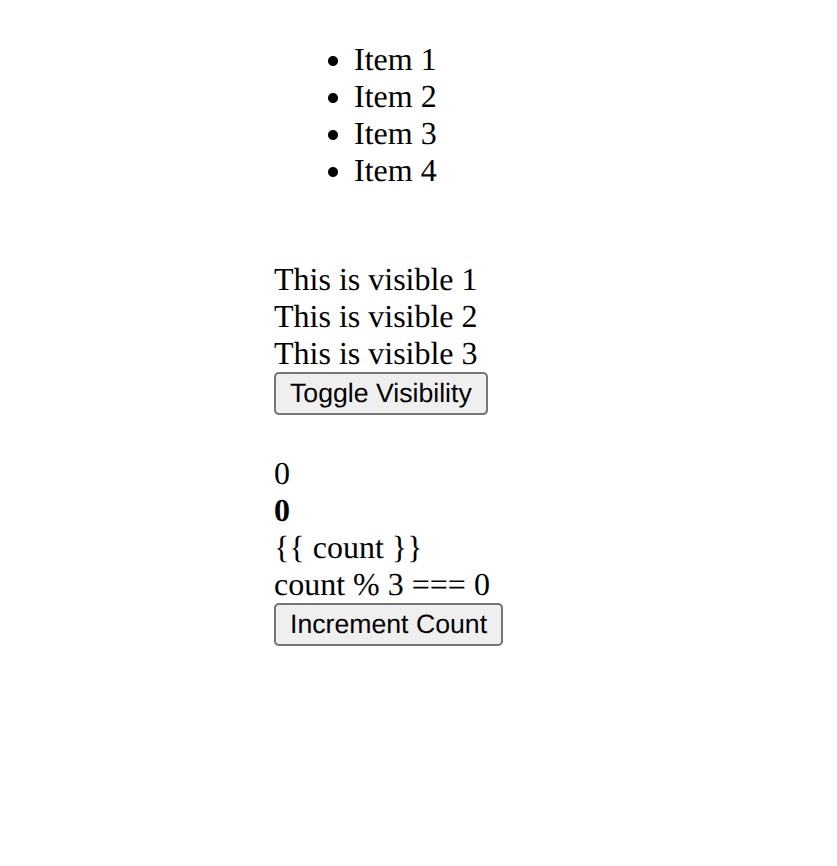 |
| **ChildComponent / ParentComponent** |  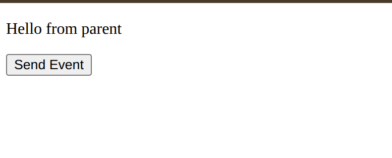 |
| **ChildComponent1 / ChildComponent2 / E06ParentComponent** | 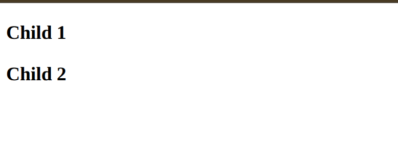  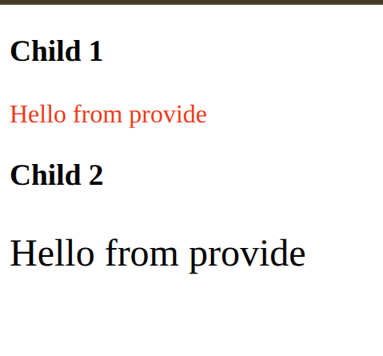 |
| **E07OptionsAPI** | 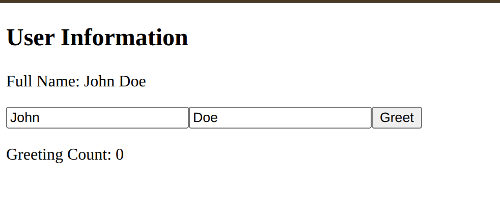 |
| **E08CompositionApi** | 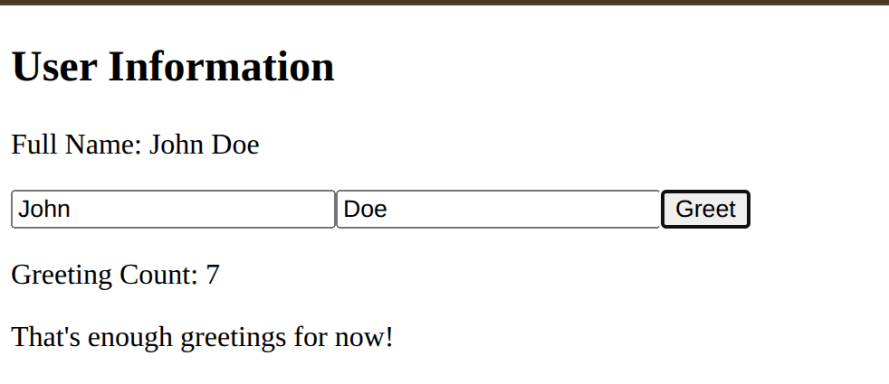 |
| **E09CompositionAPI2** |  |
| **E10Ref** | 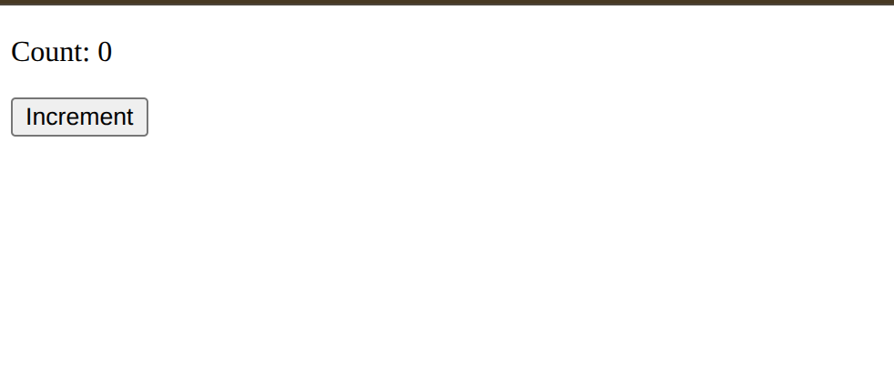 |
| **E11Reactive** | 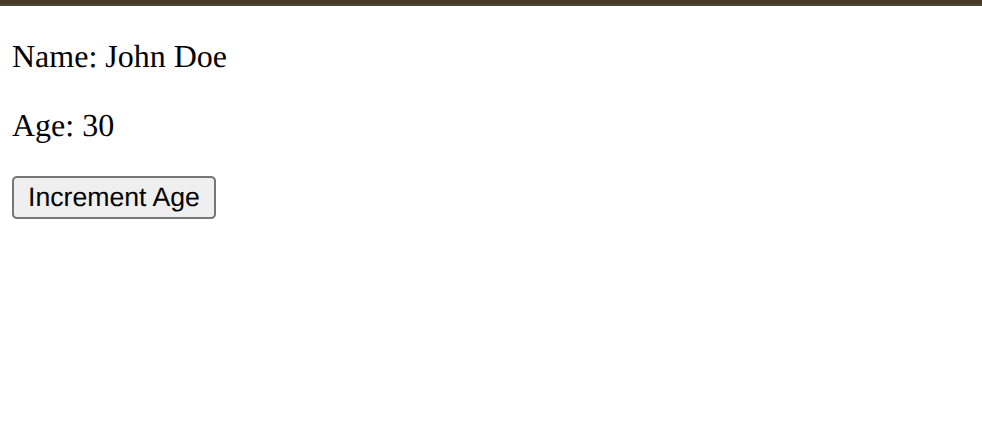 |
| **E12RefComponent** | 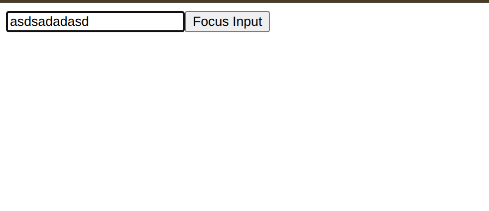 |

---


